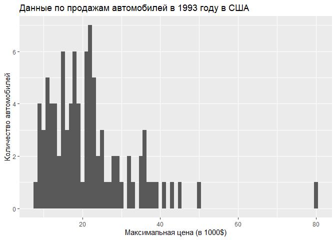
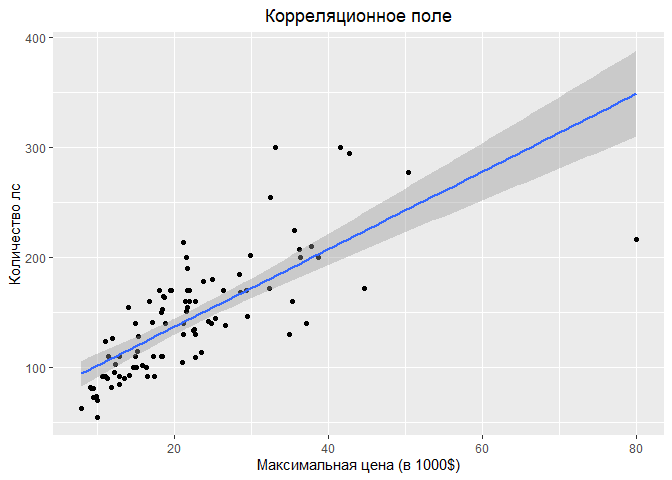
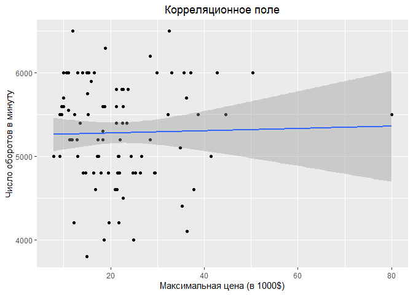
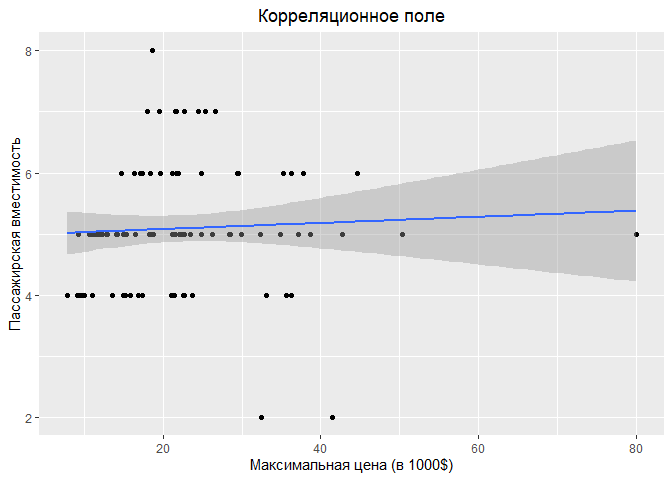
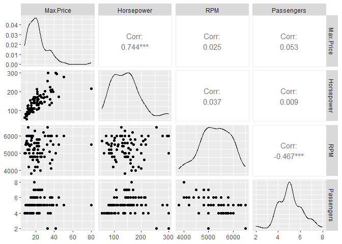

Лабораторная работа №1
================

Подключим необходимые библиотеки

``` r
library("psych")
library("lmtest")
library("ggplot2")
library("dplyr")
library("MASS")
library("GGally")
```

## Первичный просмотр данных

Импортируем датасет Cars93 (вариант № 5)

``` r
data <- Cars93
head(data, 10)
```

    ##    Manufacturer      Model    Type Min.Price Price Max.Price MPG.city
    ## 1         Acura    Integra   Small      12.9  15.9      18.8       25
    ## 2         Acura     Legend Midsize      29.2  33.9      38.7       18
    ## 3          Audi         90 Compact      25.9  29.1      32.3       20
    ## 4          Audi        100 Midsize      30.8  37.7      44.6       19
    ## 5           BMW       535i Midsize      23.7  30.0      36.2       22
    ## 6         Buick    Century Midsize      14.2  15.7      17.3       22
    ## 7         Buick    LeSabre   Large      19.9  20.8      21.7       19
    ## 8         Buick Roadmaster   Large      22.6  23.7      24.9       16
    ## 9         Buick    Riviera Midsize      26.3  26.3      26.3       19
    ## 10     Cadillac    DeVille   Large      33.0  34.7      36.3       16
    ##    MPG.highway            AirBags DriveTrain Cylinders EngineSize Horsepower
    ## 1           31               None      Front         4        1.8        140
    ## 2           25 Driver & Passenger      Front         6        3.2        200
    ## 3           26        Driver only      Front         6        2.8        172
    ## 4           26 Driver & Passenger      Front         6        2.8        172
    ## 5           30        Driver only       Rear         4        3.5        208
    ## 6           31        Driver only      Front         4        2.2        110
    ## 7           28        Driver only      Front         6        3.8        170
    ## 8           25        Driver only       Rear         6        5.7        180
    ## 9           27        Driver only      Front         6        3.8        170
    ## 10          25        Driver only      Front         8        4.9        200
    ##     RPM Rev.per.mile Man.trans.avail Fuel.tank.capacity Passengers Length
    ## 1  6300         2890             Yes               13.2          5    177
    ## 2  5500         2335             Yes               18.0          5    195
    ## 3  5500         2280             Yes               16.9          5    180
    ## 4  5500         2535             Yes               21.1          6    193
    ## 5  5700         2545             Yes               21.1          4    186
    ## 6  5200         2565              No               16.4          6    189
    ## 7  4800         1570              No               18.0          6    200
    ## 8  4000         1320              No               23.0          6    216
    ## 9  4800         1690              No               18.8          5    198
    ## 10 4100         1510              No               18.0          6    206
    ##    Wheelbase Width Turn.circle Rear.seat.room Luggage.room Weight  Origin
    ## 1        102    68          37           26.5           11   2705 non-USA
    ## 2        115    71          38           30.0           15   3560 non-USA
    ## 3        102    67          37           28.0           14   3375 non-USA
    ## 4        106    70          37           31.0           17   3405 non-USA
    ## 5        109    69          39           27.0           13   3640 non-USA
    ## 6        105    69          41           28.0           16   2880     USA
    ## 7        111    74          42           30.5           17   3470     USA
    ## 8        116    78          45           30.5           21   4105     USA
    ## 9        108    73          41           26.5           14   3495     USA
    ## 10       114    73          43           35.0           18   3620     USA
    ##                Make
    ## 1     Acura Integra
    ## 2      Acura Legend
    ## 3           Audi 90
    ## 4          Audi 100
    ## 5          BMW 535i
    ## 6     Buick Century
    ## 7     Buick LeSabre
    ## 8  Buick Roadmaster
    ## 9     Buick Riviera
    ## 10 Cadillac DeVille

Посмотрим описание датасета

``` r
glimpse(data)
```

    ## Rows: 93
    ## Columns: 27
    ## $ Manufacturer       <fct> Acura, Acura, Audi, Audi, BMW, Buick, Buick, Buick,…
    ## $ Model              <fct> Integra, Legend, 90, 100, 535i, Century, LeSabre, R…
    ## $ Type               <fct> Small, Midsize, Compact, Midsize, Midsize, Midsize,…
    ## $ Min.Price          <dbl> 12.9, 29.2, 25.9, 30.8, 23.7, 14.2, 19.9, 22.6, 26.…
    ## $ Price              <dbl> 15.9, 33.9, 29.1, 37.7, 30.0, 15.7, 20.8, 23.7, 26.…
    ## $ Max.Price          <dbl> 18.8, 38.7, 32.3, 44.6, 36.2, 17.3, 21.7, 24.9, 26.…
    ## $ MPG.city           <int> 25, 18, 20, 19, 22, 22, 19, 16, 19, 16, 16, 25, 25,…
    ## $ MPG.highway        <int> 31, 25, 26, 26, 30, 31, 28, 25, 27, 25, 25, 36, 34,…
    ## $ AirBags            <fct> None, Driver & Passenger, Driver only, Driver & Pas…
    ## $ DriveTrain         <fct> Front, Front, Front, Front, Rear, Front, Front, Rea…
    ## $ Cylinders          <fct> 4, 6, 6, 6, 4, 4, 6, 6, 6, 8, 8, 4, 4, 6, 4, 6, 6, …
    ## $ EngineSize         <dbl> 1.8, 3.2, 2.8, 2.8, 3.5, 2.2, 3.8, 5.7, 3.8, 4.9, 4…
    ## $ Horsepower         <int> 140, 200, 172, 172, 208, 110, 170, 180, 170, 200, 2…
    ## $ RPM                <int> 6300, 5500, 5500, 5500, 5700, 5200, 4800, 4000, 480…
    ## $ Rev.per.mile       <int> 2890, 2335, 2280, 2535, 2545, 2565, 1570, 1320, 169…
    ## $ Man.trans.avail    <fct> Yes, Yes, Yes, Yes, Yes, No, No, No, No, No, No, Ye…
    ## $ Fuel.tank.capacity <dbl> 13.2, 18.0, 16.9, 21.1, 21.1, 16.4, 18.0, 23.0, 18.…
    ## $ Passengers         <int> 5, 5, 5, 6, 4, 6, 6, 6, 5, 6, 5, 5, 5, 4, 6, 7, 8, …
    ## $ Length             <int> 177, 195, 180, 193, 186, 189, 200, 216, 198, 206, 2…
    ## $ Wheelbase          <int> 102, 115, 102, 106, 109, 105, 111, 116, 108, 114, 1…
    ## $ Width              <int> 68, 71, 67, 70, 69, 69, 74, 78, 73, 73, 74, 66, 68,…
    ## $ Turn.circle        <int> 37, 38, 37, 37, 39, 41, 42, 45, 41, 43, 44, 38, 39,…
    ## $ Rear.seat.room     <dbl> 26.5, 30.0, 28.0, 31.0, 27.0, 28.0, 30.5, 30.5, 26.…
    ## $ Luggage.room       <int> 11, 15, 14, 17, 13, 16, 17, 21, 14, 18, 14, 13, 14,…
    ## $ Weight             <int> 2705, 3560, 3375, 3405, 3640, 2880, 3470, 4105, 349…
    ## $ Origin             <fct> non-USA, non-USA, non-USA, non-USA, non-USA, USA, U…
    ## $ Make               <fct> Acura Integra, Acura Legend, Audi 90, Audi 100, BMW…

Посмотрим описательные статистики датасета (среднее, мода, медиана,
стандартное отклонение, минимум/максимум, асимметрия, эксцесс, и т. д.)

``` r
describe(data)
```

    ##                    vars  n    mean     sd median trimmed    mad    min    max
    ## Manufacturer*         1 93   15.92   8.99   14.0   15.71  11.86    1.0   32.0
    ## Model*                2 93   47.00  26.99   47.0   47.00  34.10    1.0   93.0
    ## Type*                 3 93    3.35   1.55    3.0    3.32   1.48    1.0    6.0
    ## Min.Price             4 93   17.13   8.75   14.7   15.97   7.71    6.7   45.4
    ## Price                 5 93   19.51   9.66   17.7   18.29   8.30    7.4   61.9
    ## Max.Price             6 93   21.90  11.03   19.6   20.56   8.01    7.9   80.0
    ## MPG.city              7 93   22.37   5.62   21.0   21.61   4.45   15.0   46.0
    ## MPG.highway           8 93   29.09   5.33   28.0   28.60   4.45   20.0   50.0
    ## AirBags*              9 93    2.19   0.71    2.0    2.24   1.48    1.0    3.0
    ## DriveTrain*          10 93    2.06   0.53    2.0    2.08   0.00    1.0    3.0
    ## Cylinders*           11 93    2.92   1.18    2.0    2.83   0.00    1.0    6.0
    ## EngineSize           12 93    2.67   1.04    2.4    2.56   0.89    1.0    5.7
    ## Horsepower           13 93  143.83  52.37  140.0  138.95  44.48   55.0  300.0
    ## RPM                  14 93 5280.65 596.73 5200.0 5309.33 593.04 3800.0 6500.0
    ## Rev.per.mile         15 93 2332.20 496.51 2340.0 2316.40 407.71 1320.0 3755.0
    ## Man.trans.avail*     16 93    1.66   0.48    2.0    1.69   0.00    1.0    2.0
    ## Fuel.tank.capacity   17 93   16.66   3.28   16.4   16.67   3.11    9.2   27.0
    ## Passengers           18 93    5.09   1.04    5.0    5.03   1.48    2.0    8.0
    ## Length               19 93  183.20  14.60  183.0  183.27  13.34  141.0  219.0
    ## Wheelbase            20 93  103.95   6.82  103.0  103.89   7.41   90.0  119.0
    ## Width                21 93   69.38   3.78   69.0   69.31   4.45   60.0   78.0
    ## Turn.circle          22 93   38.96   3.22   39.0   39.01   2.97   32.0   45.0
    ## Rear.seat.room       23 91   27.83   2.99   27.5   27.81   2.97   19.0   36.0
    ## Luggage.room         24 82   13.89   3.00   14.0   13.82   2.97    6.0   22.0
    ## Weight               25 93 3072.90 589.90 3040.0 3080.60 704.24 1695.0 4105.0
    ## Origin*              26 93    1.48   0.50    1.0    1.48   0.00    1.0    2.0
    ## Make*                27 93   47.00  26.99   47.0   47.00  34.10    1.0   93.0
    ##                     range  skew kurtosis    se
    ## Manufacturer*        31.0  0.20    -1.19  0.93
    ## Model*               92.0  0.00    -1.24  2.80
    ## Type*                 5.0 -0.01    -1.00  0.16
    ## Min.Price            38.7  1.15     0.82  0.91
    ## Price                54.5  1.48     3.05  1.00
    ## Max.Price            72.1  1.97     6.77  1.14
    ## MPG.city             31.0  1.65     3.58  0.58
    ## MPG.highway          30.0  1.19     2.30  0.55
    ## AirBags*              2.0 -0.29    -1.03  0.07
    ## DriveTrain*           2.0  0.07     0.48  0.05
    ## Cylinders*            5.0  0.46    -1.14  0.12
    ## EngineSize            4.7  0.83     0.23  0.11
    ## Horsepower          245.0  0.92     0.90  5.43
    ## RPM                2700.0 -0.25    -0.51 61.88
    ## Rev.per.mile       2435.0  0.27     0.08 51.49
    ## Man.trans.avail*      1.0 -0.65    -1.60  0.05
    ## Fuel.tank.capacity   17.8  0.10    -0.01  0.34
    ## Passengers            6.0  0.06     0.74  0.11
    ## Length               78.0 -0.09     0.29  1.51
    ## Wheelbase            29.0  0.11    -0.87  0.71
    ## Width                18.0  0.26    -0.36  0.39
    ## Turn.circle          13.0 -0.13    -0.81  0.33
    ## Rear.seat.room       17.0  0.08     0.70  0.31
    ## Luggage.room         16.0  0.22     0.36  0.33
    ## Weight             2410.0 -0.14    -0.92 61.17
    ## Origin*               1.0  0.06    -2.02  0.05
    ## Make*                92.0  0.00    -1.24  2.80

Построим гистограмму для параметра Max.Price

``` r
ggplot(data, aes(x = Max.Price)) +
  geom_histogram(binwidth = 1) +
  labs(title = "Данные по продажам автомобилей в 1993 году в США",
       x = "Максимальная цена (в 1000$)",
       y = "Количество автомобилей")
```

<!-- -->

Рассмотрим зависимость максимальной цены от количества лошадинных сил

``` r
ggplot(data, aes(x = Max.Price,
                 y = Horsepower)) +
  geom_point() +
  geom_smooth(method = "lm", formula = y ~ x) +
  labs(title = "Корреляционное поле",
       x = "Максимальная цена (в 1000$)",
       y = "Количество лс") + 
  theme(plot.title = element_text(hjust = 0.5))
```

<!-- -->

Рассмотрим зависимость максимальной цены от числа оборотов в минуту при
максимальных лошадинных силах

``` r
ggplot(data, aes(x = Max.Price,
                 y = RPM)) +
  geom_point() +
  geom_smooth(method = "lm", formula = y ~ x) +
  labs(title = "Корреляционное поле",
       x = "Максимальная цена (в 1000$)",
       y = "Число оборотов в минуту") + 
  theme(plot.title = element_text(hjust = 0.5))
```

<!-- -->

Рассмотрим зависимость максимальной цены от пассажирской вместимости

``` r
ggplot(data, aes(x = Max.Price,
                 y = Passengers)) +
  geom_point() +
  geom_smooth(method = "lm", formula = y ~ x) +
  labs(title = "Корреляционное поле",
       x = "Максимальная цена (в 1000$)",
       y = "Пассажирская вместимость") + 
  theme(plot.title = element_text(hjust = 0.5))
```

<!-- -->

## Построение парных регрессий, согласно варианту

Построим парную регрессию Max.Price и Horsepower

``` r
horsepower_model = lm(data = data, Max.Price ~ Horsepower)
```

Коэффициенты модели

``` r
horsepower_model$coefficients
```

    ## (Intercept)  Horsepower 
    ##  -0.6512618   0.1567858

Уравнение модели

``` r
horsepower_b0 = horsepower_model$coefficients[1]
horsepower_b1 = horsepower_model$coefficients[2]

equation_str <- sprintf("Max.Price = %f + %f * Horsepower", horsepower_b0, horsepower_b1)

cat(equation_str)
```

    ## Max.Price = -0.651262 + 0.156786 * Horsepower

Полное описание модели

``` r
summary(horsepower_model)
```

    ## 
    ## Call:
    ## lm(formula = Max.Price ~ Horsepower, data = data)
    ## 
    ## Residuals:
    ##     Min      1Q  Median      3Q     Max 
    ## -13.284  -3.795  -1.051   2.727  46.629 
    ## 
    ## Coefficients:
    ##             Estimate Std. Error t value Pr(>|t|)    
    ## (Intercept) -0.65126    2.25493  -0.289    0.773    
    ## Horsepower   0.15679    0.01474  10.636   <2e-16 ***
    ## ---
    ## Signif. codes:  0 '***' 0.001 '**' 0.01 '*' 0.05 '.' 0.1 ' ' 1
    ## 
    ## Residual standard error: 7.405 on 91 degrees of freedom
    ## Multiple R-squared:  0.5542, Adjusted R-squared:  0.5493 
    ## F-statistic: 113.1 on 1 and 91 DF,  p-value: < 2.2e-16

Построим парную регрессию Max.Price и RPM

``` r
rpm_model = lm(data = data, Max.Price ~ RPM)
```

Коэффициенты модели

``` r
rpm_model$coefficients
```

    ##  (Intercept)          RPM 
    ## 1.945719e+01 4.623929e-04

Уравнение модели

``` r
rpm_b0 = rpm_model$coefficients[1]
rpm_b1 = rpm_model$coefficients[2]

equation_str <- sprintf("Max.Price = %f + %f * RPM", rpm_b0, rpm_b1)

cat(equation_str)
```

    ## Max.Price = 19.457192 + 0.000462 * RPM

Полное описание модели

``` r
summary(rpm_model)
```

    ## 
    ## Call:
    ## lm(formula = Max.Price ~ RPM, data = data)
    ## 
    ## Residuals:
    ##     Min      1Q  Median      3Q     Max 
    ## -13.869  -7.332  -1.799   3.623  58.000 
    ## 
    ## Coefficients:
    ##              Estimate Std. Error t value Pr(>|t|)  
    ## (Intercept) 1.946e+01  1.029e+01   1.890   0.0619 .
    ## RPM         4.624e-04  1.937e-03   0.239   0.8119  
    ## ---
    ## Signif. codes:  0 '***' 0.001 '**' 0.01 '*' 0.05 '.' 0.1 ' ' 1
    ## 
    ## Residual standard error: 11.09 on 91 degrees of freedom
    ## Multiple R-squared:  0.0006257,  Adjusted R-squared:  -0.01036 
    ## F-statistic: 0.05698 on 1 and 91 DF,  p-value: 0.8119

Построим парную регрессию Max.Price и Passengers

``` r
passengers_model = lm(data = data, Max.Price ~ Passengers)
```

Коэффициенты модели

``` r
passengers_model$coefficients
```

    ## (Intercept)  Passengers 
    ##   19.025455    0.564974

Уравнение модели

``` r
passengers_b0 = passengers_model$coefficients[1]
passengers_b1 = passengers_model$coefficients[2]

equation_str <- sprintf("Max.Price = %f + %f * Passengers", passengers_b0, passengers_b1)

cat(equation_str)
```

    ## Max.Price = 19.025455 + 0.564974 * Passengers

Полное описание модели

``` r
summary(passengers_model)
```

    ## 
    ## Call:
    ## lm(formula = Max.Price ~ Passengers, data = data)
    ## 
    ## Residuals:
    ##     Min      1Q  Median      3Q     Max 
    ## -13.385  -7.650  -2.815   2.950  58.150 
    ## 
    ## Coefficients:
    ##             Estimate Std. Error t value Pr(>|t|)   
    ## (Intercept)   19.026      5.768   3.299  0.00139 **
    ## Passengers     0.565      1.111   0.508  0.61243   
    ## ---
    ## Signif. codes:  0 '***' 0.001 '**' 0.01 '*' 0.05 '.' 0.1 ' ' 1
    ## 
    ## Residual standard error: 11.08 on 91 degrees of freedom
    ## Multiple R-squared:  0.002832,   Adjusted R-squared:  -0.008126 
    ## F-statistic: 0.2584 on 1 and 91 DF,  p-value: 0.6124

Как видим, из парных регрессий наилучшая - регрессия Max.Price и
Horsepower

## Построение множественной регрессии согласно варианту

Построим корреляционную матрицу, диаграммы рассеяния и сглаженные
распределения зависимостей Max.Price от Horsepower, RPM, Passengers

``` r
ggpairs(data, 
        columns = c("Max.Price", "Horsepower", "RPM", "Passengers"),         progress = F)
```

<!-- -->

Построим регрессионную модель зависимости Max.Price от Horsepower, RPM,
Passengers

``` r
full_model = lm(data = data, Max.Price~Horsepower + RPM 
                + Passengers)
```

Отобразим коэффициенты

``` r
full_model$coefficients
```

    ##  (Intercept)   Horsepower          RPM   Passengers 
    ## -6.157329253  0.156481089  0.000458688  0.614965986

Уравнение модели

``` r
full_b0 = full_model$coefficients[1]
full_b1 = full_model$coefficients[2]
full_b2 = full_model$coefficients[3]
full_b3 = full_model$coefficients[4]

equation_str <- sprintf("Max.Price = %f + %f * Horsepower + %f * RPM + %f * Passengers", full_b0, full_b1, full_b2, full_b3)

cat(equation_str)
```

    ## Max.Price = -6.157329 + 0.156481 * Horsepower + 0.000459 * RPM + 0.614966 * Passengers

Полное описание модели

``` r
summary(full_model)
```

    ## 
    ## Call:
    ## lm(formula = Max.Price ~ Horsepower + RPM + Passengers, data = data)
    ## 
    ## Residuals:
    ##     Min      1Q  Median      3Q     Max 
    ## -12.899  -3.466  -0.682   2.434  46.603 
    ## 
    ## Coefficients:
    ##               Estimate Std. Error t value Pr(>|t|)    
    ## (Intercept) -6.1573293 10.6744157  -0.577    0.566    
    ## Horsepower   0.1564811  0.0148783  10.517   <2e-16 ***
    ## RPM          0.0004587  0.0014768   0.311    0.757    
    ## Passengers   0.6149660  0.8476782   0.725    0.470    
    ## ---
    ## Signif. codes:  0 '***' 0.001 '**' 0.01 '*' 0.05 '.' 0.1 ' ' 1
    ## 
    ## Residual standard error: 7.466 on 89 degrees of freedom
    ## Multiple R-squared:  0.5568, Adjusted R-squared:  0.5419 
    ## F-statistic: 37.27 on 3 and 89 DF,  p-value: 1.07e-15

Как видно, новая модель чуть лучше модели, завязанной на Horsepower

Построим предсказание, согласно варианту (Horsepower = 220, RPM = 6000,
Passengers = 6)

``` r
input = data.frame(Horsepower = 220, RPM = 6000, Passengers = 6)
prediction = predict(full_model, input)
prediction
```

    ##        1 
    ## 34.71043

``` r
prediction_str <- sprintf("Автомобиль с параметрами Horsepower = 220, RPM = 6000, Passengers = 6 будет иметь максимальную цену (параметр Max.Price) $%.2f)", prediction * 1000)

cat(prediction_str)
```

    ## Автомобиль с параметрами Horsepower = 220, RPM = 6000, Passengers = 6 будет иметь максимальную цену (параметр Max.Price) $34710.43)
